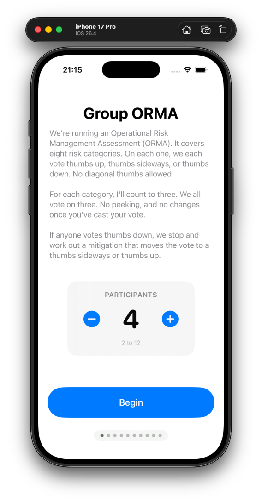
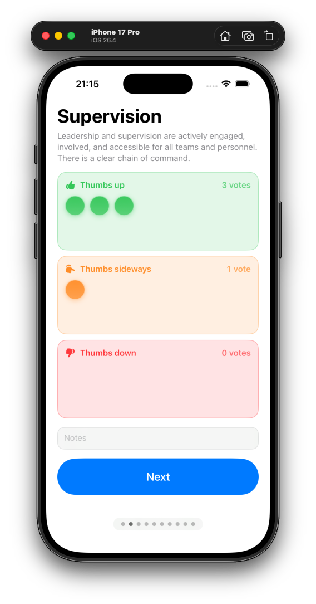
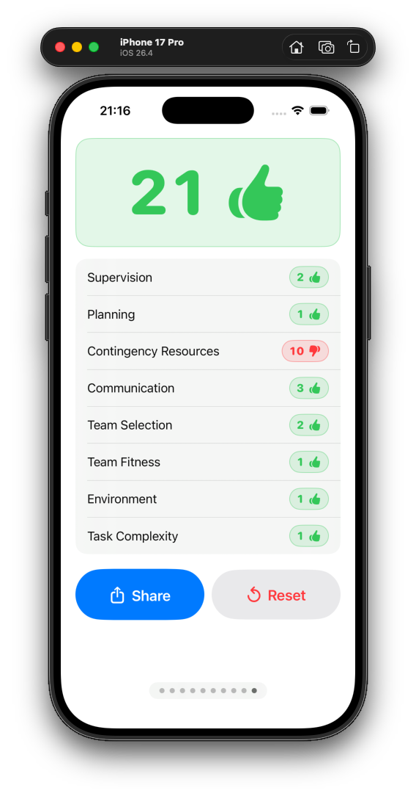

# Group ORMA

[](LICENSE)
[](https://developer.apple.com/ios/)
[](https://swift.org/)

A native iOS app that helps a search-and-rescue team run a group ORMA (Operational Risk Management Assessment) without any mental math. Each participant has a token. Tap a zone to vote thumbs up, sideways, or down. The score falls out.

<p align="center">
  
  
  
</p>

Not affiliated with the National Park Service.

## Why

The existing NPS Risk app forces one person to type a 0-10 score per category. With 2-12 people in a circle, that's slow and lossy. This app turns the vote into a physical gesture: drop your token in a zone, the average updates live, the team sees the same screen.

## Categories

The 8 ORMA categories, with the standard descriptions from NPS RM-50B Chapter 46 ([reference notes](RM-50B_Chp46_Operational_Leadership.md)):

1. Supervision
2. Planning
3. Contingency Resources
4. Communication
5. Team Selection
6. Team Fitness
7. Environment
8. Task Complexity

## Scoring

- Thumbs up = 1, thumbs sideways = 5, thumbs down = 10 (per token).
- Category score = average of all tokens, rounded (1-10).
- Overall = sum of the 8 category averages (8-80).
- Risk bands match NPS RM-50B Table C-2: **Low** 8-35, **Medium** 36-60, **High** 61-70, **Extremely High** 71-80. Extreme triggers a danger-octagon icon and (per Table 5) requires halting until Superintendent-level approval.
- Per-category bands on the 1-10 scale are derived proportionally: 1-4 Low, 5-7 Medium, 8 High, 9-10 Extreme.

## Notes

Each category pane has a free-form notes field for hazards, outliers, and rationale. Notes flow into the Summary pane and the share output, satisfying the RM-50B §46.6.8 documentation requirement.

## Build & run

```bash
# Generate Xcode project (only needed after editing project.yml)
xcodegen generate

# Pick an iPhone simulator UDID
xcrun simctl list devices available | grep "iPhone 17 Pro"

# Build
xcodebuild -scheme GroupORMA -destination 'platform=iOS Simulator,id=<UDID>' -configuration Debug build

# Install + launch
APP=~/Library/Developer/Xcode/DerivedData/GroupORMA-*/Build/Products/Debug-iphonesimulator/GroupORMA.app
xcrun simctl install <UDID> "$APP"
xcrun simctl launch <UDID> com.lucaswoj.grouporma

# Screenshot
xcrun simctl io <UDID> screenshot /tmp/grouporma.png
```

## Stack

- SwiftUI, iOS 17+
- `@Observable` state, persisted to `UserDefaults`
- `TabView` with `.page` style for swipe navigation
- `.draggable` / `.dropDestination` with `Transferable` for token drag
- `ShareLink` for the share sheet
- Xcode project generated by [XcodeGen](https://github.com/yonaskolb/XcodeGen) from `project.yml`

## License

MIT. See [LICENSE](LICENSE).
